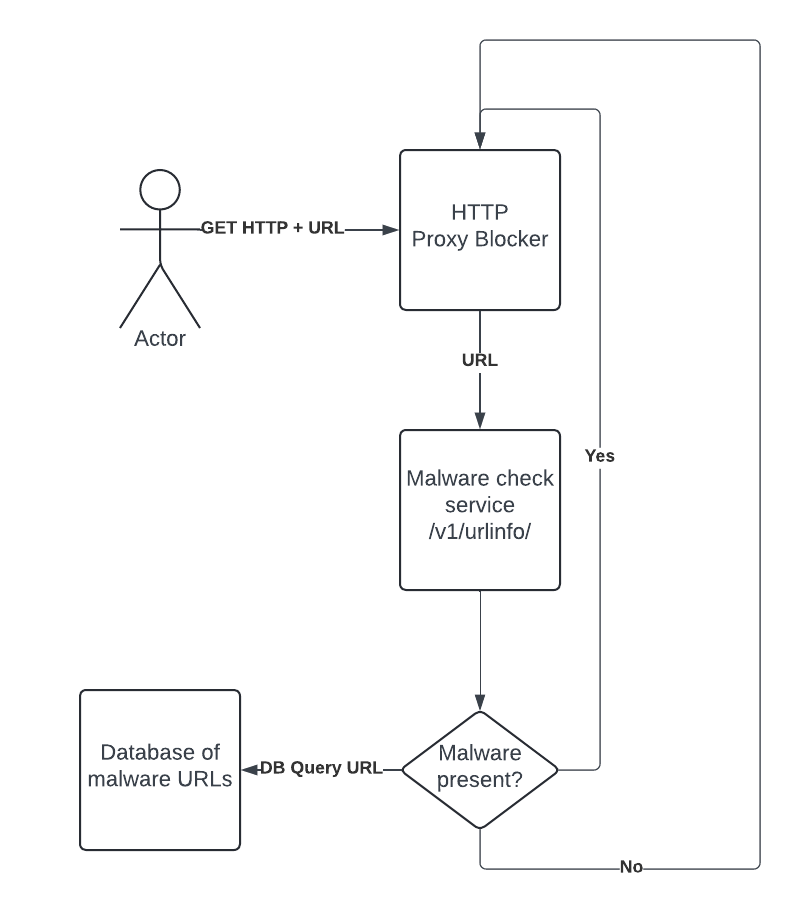
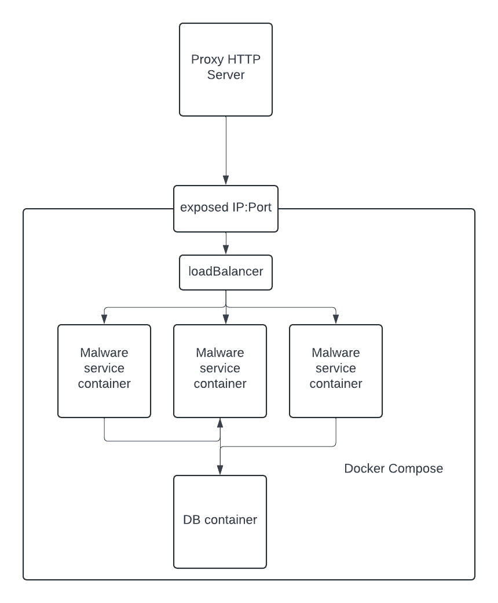
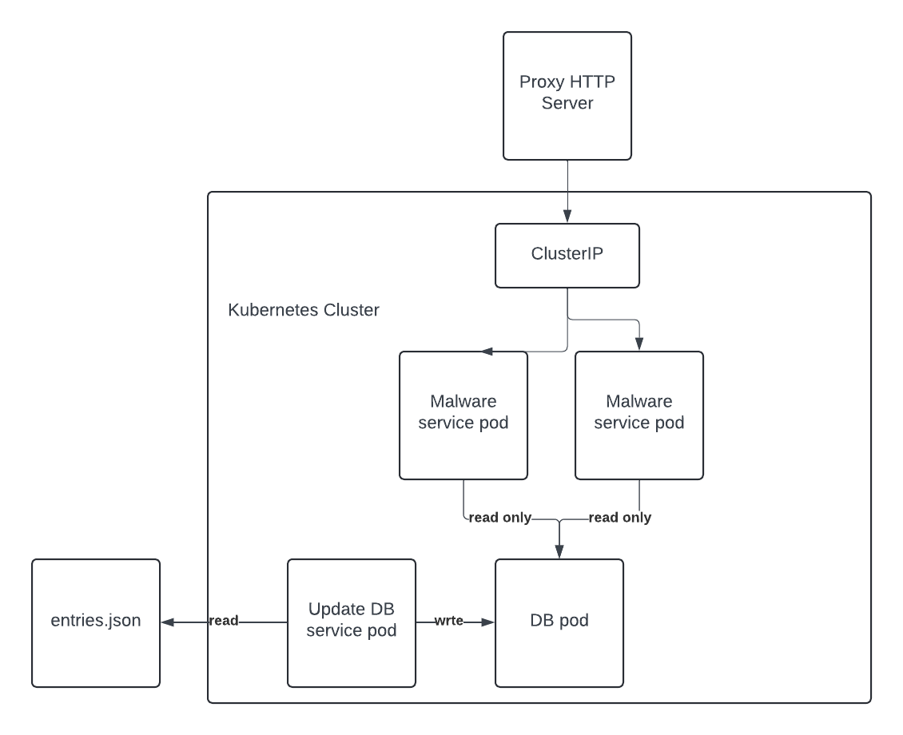

# URL-lookup

Coding assignment for interview. Implement a URL lookup that will block if malware is known to exist in that URL

## Contents

* [System Requirements](#system-requirements)
* [Project Diagram](#project-diagram)
* [System Setup](#system-setup)
* [Task Questions](#task-questions)
* [Testing](#testing)
* [Task Definition](#task-definition)

## System Requirements

* golang insalled
* SQL server running locally
* I am using on a Windows dev env - this code should be compatible across platforms but the execution of the server file may be different depeding on your operating system

## Project Diagram



## System Setup

Clone the repo

```sh
git clone https://github.com/nhennigan/URL-lookup.git
```

Edit the credentials.env file to add your own MySQL server details. The username and hostname are the default settings when setting up a MySQL server.

```sh
password=XXXXXXXX
username=root
hostname =127.0.0.1:3306
```

Build the executable

```sh
go build
```

This will create a server.exe file in your local repo. Run this to start the server

```sh
.\server.exe
```

If you open a new tab on your browser and enter:

```sh
127.0.0.1:8080/v1/urlinfo/
```

This will show the output of the server. To input values to check the url database, add the url you want to search to the search bar. For example:

```sh
127.0.0.1:8080/v1/urlinfo/wx7.com
```


The service will check the database if that URL entry exists and if it has malware present.

## Task Questions

### What are some strategies you might use to update the service with new URLs? Updates may be as many as 5000 URLs a day with updates arriving every 10 minutes

For this system I only created a sample database using MySQL as that is the database that I have already configured on my development environment. This database is also very simple with only one table with two fields. MySQL is known to be slower in look ups than a NoSQL server, especially as the data grows in size and the type of data being store is not uniform. As the databases scale, it would make sense to move to NoSQL.

I have implemented a simple ticker [here](server.go#L46) that will read the entries.json file and add new URLs to the database or update the exsisting URL malware status if necessary. The thought process here would be that the entries.json file would be controlled by whoever is providing the info on whether a URL is safe or not for our DB. We could extend the server functionality to check for new json files to read in from a certain location. As the ticker is using a go routine, this would have to made safe with something like a sync lock.

### The size of the URL list could grow infinitely, how might you scale this beyond the memory capacity of the system? Bonus if you implement this

Vertically scaling the location where the database is held will allow it to scale beyong my development environment constraints. In many cloud providers, this scaling opportunity is seemingly endless. Database sharding can also be used to split the datbase into smaller more manageable pieces. These shards can be places accross different servers thus resources can be shared across more than one server.

### The number of requests may exceed the capacity of this system, how might you solve that? Bonus if you implement this

At the moment I have set the limit of requests per second to 15 [here](server.go#L12) as a low threshold for testing on my development environment. This could be much higher on more powerful servers. This would be vertically scaling the system by adding more resoures. I also set db connection limits [here](db.go#L37). Again, scaling vertically with a more powerful server would allow you to drastically increase these limits.

You coud also horizontially scale the process in the form of containers/pods that can be duplicated. A service IP would provide the one endpoint to the proxy HTML server and the service will provide by default a round robin distribution of traffic accross however many instances of the url lookup you want. There would have to be one underlying database that all url lookup containers/pods can use - this would also have to be go routine safe. This could be done by extracting the ticker (i.e. the database updater) to a seperate service that is the only one with write access to the database. A simplified diagram of this setup using docker compose would look like:



And a simlar sentiment for a kubernetes cluster:



## Testing

There are unit tests for all functions in this repo. To run the test enter:

```sh
go test
```

To see the more verbose output add -v .

## Task Definition

Malware URL Lookup Exercise
For this exercise, we would like to see how you solve a coding challenge with architecting for
the future in mind.

One of our key values in how we develop new systems is to start with simple implementations
and progressively make them more capable, scalable, and reliable. You are encouraged to get
something that meets the base requirements working ASAP, and then iterate to improve on it.
We ask that you use a Git-based repository (Bitbucket, GitHub, etc.) to commit your updates. It's
up to you how frequently you commit and what you decide to include in each push, but we are
particularly curious about your development workflow and how you handle revision control.
Please also include some unit tests for your project, and detailed instructions on how to get the
application up and running. Assume we know nothing about how it needs to be run. You can
use any languages/technologies/platforms you like.
Here's what we would like you to build:

Malware URL lookup service
We have an HTTP proxy that is scanning traffic, looking for malware URLs. Before allowing
HTTP connections to be made, this proxy asks a service that maintains several databases of
malware URLs if the resource being requested is known to contain malware.

Write a small web service, preferably in Go or Python, that responds to GET requests where the
caller passes in a URL and the service responds with some information about that URL. The
GET requests would look like this:
GET /v1/urlinfo/{resource_url_with_query_string}

The caller wants to know if it is safe to access that URL or not. As the implementer, you get to
choose the authorization, response format and structure. Please document the API in the
README. These lookups are blocking users from accessing the URL until the caller receives a
response from your service.

Give some thought to the following. Write-up the design, if you do not have time to code.
● The size of the URL list could grow infinitely, how might you scale this beyond the
memory capacity of the system? Bonus if you implement this.
● The number of requests may exceed the capacity of this system, how might you solve
that? Bonus if you implement this.

● What are some strategies you might use to update the service with new URLs? Updates
may be as many as 5000 URLs a day with updates arriving every 10 minutes